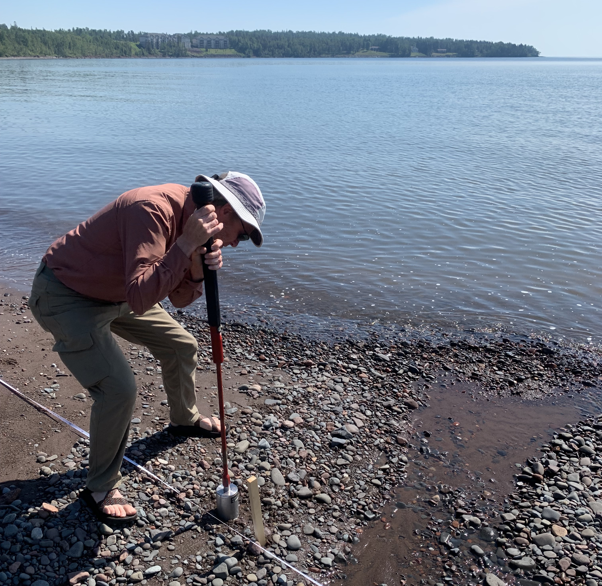
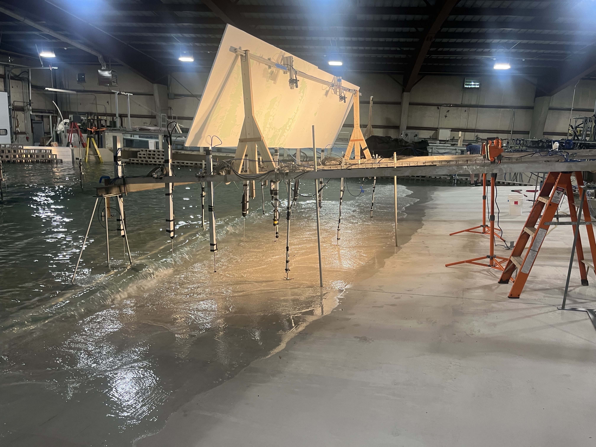
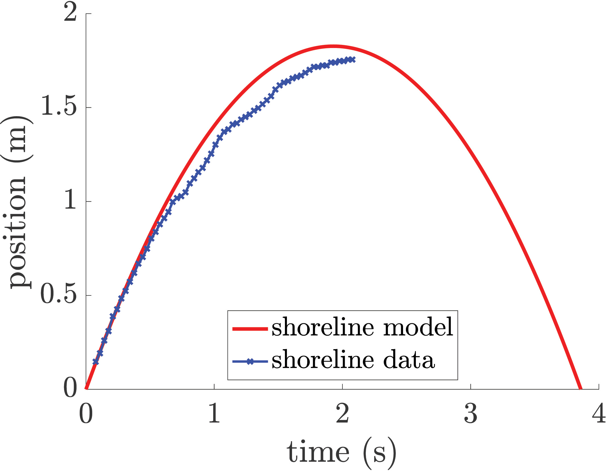

<figure>
    
    <figcaption> Plastics found on a beach in Lake Ontario.</figcaption>
</figure>

Around the globe, over 350 million tons of plastic waste are generated each year (Geyer et al., 2017, _Sci. Adv._).  While plastic has significantly enhanced the human experience—reducing infection in the medical field and reducing vehicle emissions, for example—it also poses a major environmental challenge.  Plastic waste easily contaminates natural environments, particularly our lakes, rivers, and oceans.

In marine environments, there is a discrepancy between the estimated amount of plastic entering the oceans and the amount currently accounted for.  We are working to understand the problem of [missing plastic](https://www.science.org/content/article/ninety-nine-percent-ocean-plastic-has-gone-missing) by studying how plastic debris interacts with shoreline environments.

### Field Experiments

<figure>
    
    <figcaption> Collecting sediment core on a Lake Superior beach.</figcaption>
</figure>

I have previously conducted experiments on the beaches of Lake Superior, focusing on the accumulation and burial of microplasitcs in beach sediments.  Our [2022 study](publication/1-davidson-microplastic-2022/) showed that individual characteristics of a beach were not strong predictors of microplastic pollution.  Instead, the combination of characteristics at individual beaches significantly influences the prediction of microplastic pollution.

### Laboratory Experiments

<figure>
    <video width="600" height="240" controls>
        <source src="flume.mov" type="video/mp4">
    </video>
    <figcaption> The wave flume at the University of Wisconsin-Madison's Water Science and Engineering Laboratory. </figcaption>
</figure>

We use laboratory wave flume and basin experiments to consider the focused impact of specific characteristics on particle beaching.  Our 39-meter-long wave flume at the Water Science and Engineering Lab at the University of Wisconsin-Madison has a [custom-built beach](project/Beach/) which we have used in several beaching experiments, including those published [in Flow, in 2023](publication/1-davidson-microplastic-2022/).

<figure>
    
    <figcaption> The large wave basin at Queen's University. </figcaption>
</figure>

We have also conducted experiments in large scale wave basins at the Queen&rsquo;s University Coastal Engineering Laboratory and the Oregon State University Hinsdale Wave Research Laboratory.  In these large scale experiments, we have been able to explore the impact of wave directionality on plastic particle beaching.

### Computational Modeling

<figure>
    
    <figcaption> Swash event model and experimental shoreline positions. </figcaption>
</figure>

In addition to field and lab experiments, we explore the nearshore processes of marine debris transport through computational modeling.  We started with a simple, [1 dimensional model](publication/2-davidson-beaching-2023/), and have expanded the model to 2 dimensions with oblique incident waves.